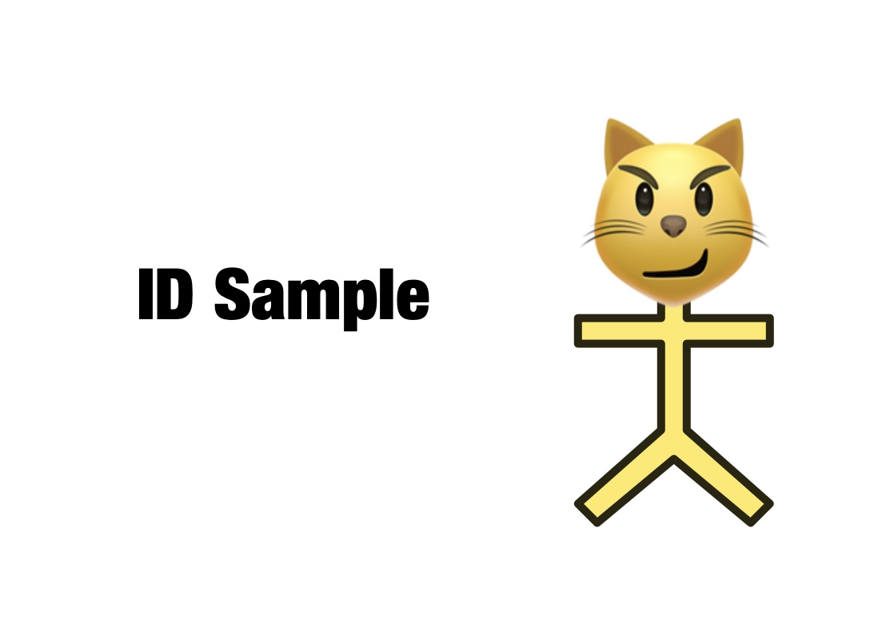
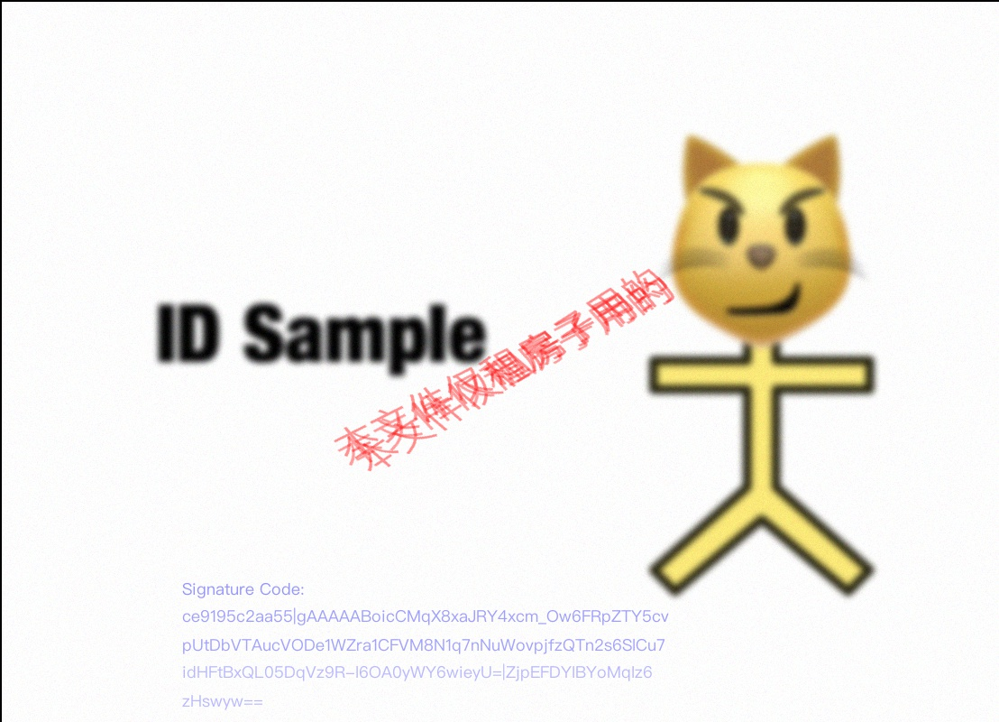

# ID Figure Watermark Tool

---

给身份证打码用的，图片模糊 + 水印 + 一个独有编码。

代码由 AI 辅助生成。

A powerful Python tool for adding secure, verifiable watermarks to images, particularly designed for identity documents and sensitive images.

## Sample Results

| Original | With Watermark |
|----------|---------------|
|  |  |

## Features

- **Multi-layer Watermarking**: Adds multiple layers of watermarks with varying opacity and slight position offsets for enhanced security
- **Digital Signature**: Embeds encrypted signatures that can be verified later
- **Anti-AI Protection**: Implements several techniques to make the images more resistant to AI manipulation:
  - Gaussian blur effects
  - Random noise addition
  - Subtle distortion effects
  - Multiple watermark layers

## Key Capabilities

- Multiple watermark positioning options:
  - Bottom right
  - Top left
  - Top right
  - Bottom left
  - Cover (diagonal across the image)
- Customizable watermark properties:
  - Font size (relative to image size)
  - Transparency levels
  - Blur intensity
  - Number of watermark layers
- Secure signature system:
  - Encryption using Fernet (symmetric encryption)
  - PBKDF2 key derivation
  - Timestamp-based validation
  - Salt-based security
- Automatic logging of all watermark operations

## Requirements

```
pillow
numpy
cryptography
python-dotenv
```

## Usage

1. Set up your environment variables:
   ```
   KEY=your-secret-key
   ```

2. Basic usage example:
   ```python
   from main import process_id_card

   input_path = "path/to/your/image.jpg"
   output_path = "path/to/output/image.jpg"
   watermark_text = "For XXX purposes only - 2025"
   signature = "user123 Valid:250801to250831_XXX Only"

   process_id_card(
       input_path=input_path,
       output_path=output_path,
       watermark_text=watermark_text,
       degree=1.5,              # blur degree
       loc="bottom_right",      # watermark location
       layer_num=3,             # number of watermark layers
       signature=signature,     # optional signature
       size=0.03,              # font size (3% of image size)
       alpha_range=(64, 128)    # opacity range
   )
   ```

3. Verify a signature:
   ```python
   from main import verify_signature
   
   decrypted = verify_signature(encoded_signature)
   print(f"Verified signature: {decrypted}")
   ```

## Security Features

- Encrypted signatures using Fernet symmetric encryption
- Salt-based key derivation for enhanced security
- Timestamp embedding for temporal validation
- Multi-layer watermarking with random offsets
- Automatic logging of all operations for audit trails

## Logging

The tool automatically maintains a JSON log file (`watermark_log.json`) containing:
- Timestamp of operation
- Input and output file paths
- Watermark text and location
- Signature details
- Process timestamp 